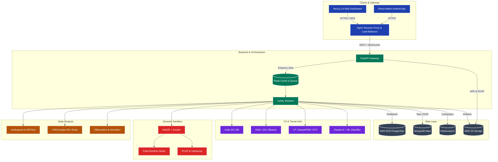

# DroidRaksha 🛡️

**India's AI-Powered APK Threat Intelligence Platform**

DroidRaksha is an advanced, high-performance static analysis platform designed to detect Android malware, specifically tailored for the Indian cybersecurity landscape. It identifies banking trojans, UPI fraud apps, loan scams, and other mobile threats through a multi-engine analysis pipeline, leveraging YARA rules, heuristics, and AI-driven narrative generation.

## 🏗️ Architecture

DroidRaksha (Round 2) employs a scalable, microservices-based architecture designed for distributed threat analysis:

## 🛠️ Tech Stack & Technical Decisions (Round 2)

DroidRaksha is built using a modern, scalable, and distributed technology stack, designed to handle intensive static and dynamic analysis workloads securely.

### 💻 Client & Gateway
- **Frontend:** Next.js 14 (App Router) + TypeScript, styled with Tailwind CSS and shadcn/ui. Includes interactive network graphs using D3.js.
- **Mobile App:** React Native application for Android users.
- **Gateway & Real-time:** Nginx reverse proxy with WebSockets for true live analysis progress tracking.

### ⚙️ Backend Orchestration
- **API Framework:** FastAPI (Python) for fully asynchronous endpoint handling.
- **Job Queue:** Celery with Redis as the message broker, offloading heavy static and dynamic analysis to distributed workers.
- **Caching:** Redis for fast state lookups and WebSocket state management.

### 🔍 Core Analysis & Sandbox Engines
- **Static Analysis:** Androguard, APKTool, and an extensive YARA engine (50+ comprehensive rules).
- **Dynamic Analysis:** Dockerized MobSF sandbox environment.
- **Runtime Monitoring:** Frida for API/file I/O hooking and `tcpdump`/`mitmproxy` for full PCAP network analysis.

### 🧠 Threat Intelligence & C2 Detection
- **AI & ML:** Anthropic Claude API for narrative generation with confidence scoring, paired with a custom ML classifier for malware families.
- **External Intel:** Integration with VirusTotal (Hash/URL/IP), AbuseIPDB, and AlienVault OTX.
- **Advanced C2 Detection:** Algorithms for detecting DGA (Domain Generation Algorithms) via Shannon entropy, TLS JA3 fingerprint matching, and timing variance analysis for live beacon detection.
- **India IOC Engine:** A fully managed database with an admin API for updating known fake UPI apps, fraudulent loan domains, and malicious Indian IPs.

### 🗄️ Distributed Data Layer
- **Relational DB:** AWS RDS (PostgreSQL) for metadata and structured threat metrics.
- **Document DB:** MongoDB Atlas for storing raw, unstructured JSON analysis results.
- **Search Engine:** Elasticsearch for rapid IOC searching and threat campaign clustering.
- **Storage:** AWS S3 for secure, scalable storage of raw APKs, PCAP dumps, and branded forensic PDF reports.

### 🚀 Infrastructure & DevOps
- **Deployment:** Docker Compose migrating to Kubernetes on AWS EC2.
- **CI/CD & Monitoring:** Automated deployment via GitHub Actions with Sentry and Grafana for error tracking and metrics monitoring.
- **Sharing:** Threat intelligence sharing via STIX 2.1 / TAXII exports and a rate-limited Bulk REST API.

## 🗺️ Roadmap & Task Status

### Phase 1: Project Scaffold
- [x] Create project directory structure
- [x] `requirements.txt`
- [x] `.env.example`
- [x] `README.md`

### Phase 2: Backend — Core
- [x] `backend/models/schemas.py` (Pydantic models)
- [x] `backend/db/database.py` (SQLite + SQLAlchemy)
- [x] YARA rules: `rules/malware.yar`
- [x] YARA rules: `rules/india_patterns.yar`

### Phase 3: Backend — Analysis Engines
- [x] `backend/engines/manifest_parser.py`
- [x] `backend/engines/string_extractor.py`
- [x] `backend/engines/cert_analyzer.py`
- [x] `backend/engines/yara_scanner.py`
- [x] `backend/engines/obfuscation.py`

### Phase 4: Backend — Intel + AI
- [x] `backend/intel/india_ioc.py`
- [x] `backend/intel/virustotal.py`
- [x] `backend/intel/abuseipdb.py`
- [x] `backend/scoring/risk_scorer.py`
- [x] `backend/ai/narrative.py`
- [x] `backend/engines/static_analyzer.py` (orchestrator)

### Phase 5: Backend — API Routes
- [x] `backend/routes/upload.py`
- [x] `backend/routes/analysis.py`
- [x] `backend/routes/report.py`
- [x] `backend/routes/stats.py`
- [x] `backend/main.py`
- [x] `backend/__init__.py` (and all sub-package init files)

### Phase 6: Frontend — Foundation
- [x] Next.js 14 project init
- [x] Install tailwind and basic configuration
- [x] Install shadcn/ui defaults
- [x] Add basic shadcn components (badge, card, progress, table, tabs)
- [ ] `frontend/app/layout.tsx`
- [ ] `frontend/lib/types.ts`
- [ ] `frontend/lib/api.ts`

### Phase 7: Frontend — Components
- [ ] `frontend/components/DropZone.tsx`
- [ ] `frontend/components/AnalysisLoader.tsx`
- [ ] `frontend/components/RiskScoreCard.tsx`
- [ ] `frontend/components/AIExplanation.tsx`
- [ ] `frontend/components/PermissionTable.tsx`
- [ ] `frontend/components/StringsTable.tsx`
- [ ] `frontend/components/CertificateCard.tsx`
- [ ] `frontend/components/MitreTable.tsx`
- [ ] `frontend/components/ExportButton.tsx`

### Phase 8: Frontend — Pages
- [ ] `frontend/app/page.tsx` (landing + upload)
- [ ] `frontend/app/results/[id]/page.tsx`
- [ ] `frontend/app/report/[hash]/page.tsx` (SSR)

### Phase 9: Verification & Launch
- [ ] Backend startup test
- [ ] Frontend startup test
- [ ] End-to-end upload test
- [ ] Final UI Polish
