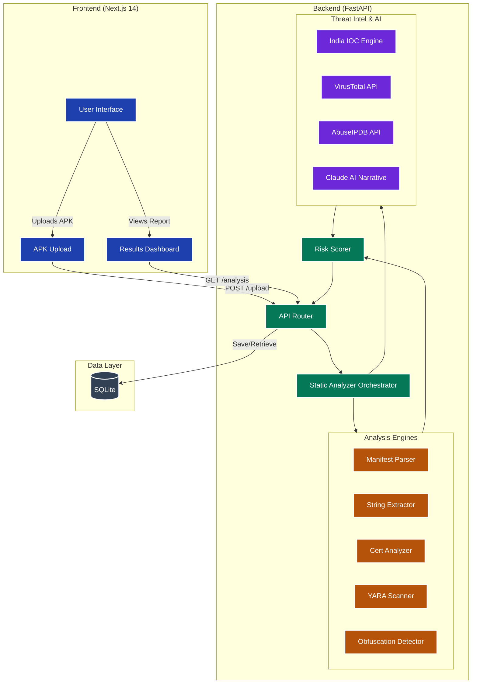

# DroidRaksha 🛡️

**India's AI-Powered APK Threat Intelligence Platform**

DroidRaksha is an advanced, high-performance static analysis platform designed to detect Android malware, specifically tailored for the Indian cybersecurity landscape. It identifies banking trojans, UPI fraud apps, loan scams, and other mobile threats through a multi-engine analysis pipeline, leveraging YARA rules, heuristics, and AI-driven narrative generation.

## 🏗️ Architecture

DroidRaksha employs a two-tier architecture optimized for rapid static analysis and detailed reporting:

1. **Frontend (Next.js 14):** A professional, responsive, dark-themed dashboard that allows users to upload APKs, view real-time analysis progress, and explore detailed threat reports. It visualizes risk scores, permission analysis, extracted strings, certificate validation, and AI-generated threat narratives.
2. **Backend (FastAPI):** A high-performance asynchronous API that orchestrates the analysis pipeline. It processes APK uploads, extracts metadata and bytecode using `androguard`, runs YARA rules, performs heuristic obfuscation detection, queries threat intelligence APIs (VirusTotal, AbuseIPDB), and cross-references India-specific IOCs (Indicators of Compromise). Finally, it aggregates the findings using a custom risk scorer and generates a natural language threat report using Claude AI.
3. **Database (SQLite + SQLAlchemy):** Stores analysis results for caching, historical tracking, and generating dashboard statistics.

## 🛠️ Tech Stack

**Frontend:**
- **Framework:** Next.js 14 (App Router, Server Components)
- **Language:** TypeScript
- **Styling:** Tailwind CSS
- **Components:** shadcn/ui
- **Icons:** Lucide React

**Backend:**
- **Framework:** FastAPI (Python 3.11+)
- **Analysis Core:** Androguard (APK/DEX parsing), YARA (Pattern matching)
- **Database ORM:** SQLAlchemy (Async) with aiosqlite
- **AI Integration:** Anthropic Claude API
- **Threat Intel:** VirusTotal API, AbuseIPDB API
- **Utilities:** Pydantic (Data validation), Loguru (Logging)

**Core Analysis Engines:**
- **Manifest Parser:** Extracts metadata, permissions, and flags dangerous combinations.
- **String Extractor:** Scans DEX bytecode for IPs, URLs, API keys, Aadhaar/PAN patterns, and Base64 payloads.
- **Certificate Analyzer:** Validates APK signing certificates, flagging self-signed, expired, or debug certificates.
- **YARA Scanner:** Runs custom malware and India-specific threat rules against the APK and its internal files.
- **Obfuscation Detector:** Analyzes class/method naming entropy, reflection, dynamic loading, and native libraries.
- **India IOC Engine:** Checks against known fake UPI apps, fraudulent domains, loan scam packages, and malicious IPs targeting India.
- **Risk Scorer:** Aggregates engine outputs into a 0-100 risk score with severity levels.

## 🗺️ Roadmap & Task Status

### Phase 1: Project Scaffold
- [x] Create project directory structure
- [x] `requirements.txt`
- [x] `.env.example`
- [x] `README.md`

### Phase 2: Backend — Core
- [x] `backend/models/schemas.py` (Pydantic models)
- [x] `backend/db/database.py` (SQLite + SQLAlchemy)
- [x] YARA rules: `rules/malware.yar`
- [x] YARA rules: `rules/india_patterns.yar`

### Phase 3: Backend — Analysis Engines
- [x] `backend/engines/manifest_parser.py`
- [x] `backend/engines/string_extractor.py`
- [x] `backend/engines/cert_analyzer.py`
- [x] `backend/engines/yara_scanner.py`
- [x] `backend/engines/obfuscation.py`

### Phase 4: Backend — Intel + AI
- [x] `backend/intel/india_ioc.py`
- [x] `backend/intel/virustotal.py`
- [x] `backend/intel/abuseipdb.py`
- [x] `backend/scoring/risk_scorer.py`
- [x] `backend/ai/narrative.py`
- [x] `backend/engines/static_analyzer.py` (orchestrator)

### Phase 5: Backend — API Routes
- [x] `backend/routes/upload.py`
- [x] `backend/routes/analysis.py`
- [x] `backend/routes/report.py`
- [x] `backend/routes/stats.py`
- [x] `backend/main.py`
- [x] `backend/__init__.py` (and all sub-package init files)

### Phase 6: Frontend — Foundation
- [x] Next.js 14 project init
- [x] Install tailwind and basic configuration
- [x] Install shadcn/ui defaults
- [x] Add basic shadcn components (badge, card, progress, table, tabs)
- [ ] `frontend/app/layout.tsx`
- [ ] `frontend/lib/types.ts`
- [ ] `frontend/lib/api.ts`

### Phase 7: Frontend — Components
- [ ] `frontend/components/DropZone.tsx`
- [ ] `frontend/components/AnalysisLoader.tsx`
- [ ] `frontend/components/RiskScoreCard.tsx`
- [ ] `frontend/components/AIExplanation.tsx`
- [ ] `frontend/components/PermissionTable.tsx`
- [ ] `frontend/components/StringsTable.tsx`
- [ ] `frontend/components/CertificateCard.tsx`
- [ ] `frontend/components/MitreTable.tsx`
- [ ] `frontend/components/ExportButton.tsx`

### Phase 8: Frontend — Pages
- [ ] `frontend/app/page.tsx` (landing + upload)
- [ ] `frontend/app/results/[id]/page.tsx`
- [ ] `frontend/app/report/[hash]/page.tsx` (SSR)

### Phase 9: Verification & Launch
- [ ] Backend startup test
- [ ] Frontend startup test
- [ ] End-to-end upload test
- [ ] Final UI Polish
