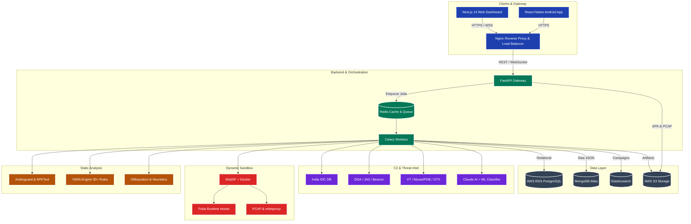

# DroidRaksha 🛡️

**India's AI-Powered APK Threat Intelligence Platform**

DroidRaksha is an advanced, high-performance static analysis platform designed to detect Android malware, specifically tailored for the Indian cybersecurity landscape. It identifies banking trojans, UPI fraud apps, loan scams, and other mobile threats through a multi-engine analysis pipeline, leveraging YARA rules, heuristics, and AI-driven narrative generation.

---

## 🔗 Quick Links

| Resource | Link |
|:---|:---|
| 🌐 **Live Demo** | [https://droid-raksha.vercel.app/](https://droid-raksha.vercel.app/) |
| 🎥 **YouTube Demo** | [DroidRaksha – An AI Powered APK Threat Intelligence Platform by PHAPGUYZ](https://www.youtube.com/watch?v=your-video-id) |
| 📊 **PPT / Presentation** | [View on Canva](https://canva.link/1sda3lngedx2cl8) |
| 💻 **GitHub Repository** | [praju455/DroidRaksha-](https://github.com/praju455/DroidRaksha-.git) |

> 🚀 **Try it live:** [https://droid-raksha.vercel.app/](https://droid-raksha.vercel.app/)

---

## 🏗️ Architecture

DroidRaksha (Round 2) employs a scalable, microservices-based architecture designed for distributed threat analysis:



### 🔍 Detailed Architecture Explanation

The architecture is divided into six primary subsystems working together to analyze and classify Android APKs:

#### 1. Clients & Gateway
*   **Next.js 14 Web Dashboard & React Native Android App:** Serve as the user interfaces for analysts and end-users to submit APKs and view results.
*   **Nginx Reverse Proxy & Load Balancer:** The secure entry point that handles incoming HTTPS/WSS traffic, providing SSL termination and routing requests to the backend.

#### 2. Backend & Orchestration
*   **FastAPI Gateway:** The core asynchronous API that processes REST requests and manages real-time WebSocket connections.
*   **Redis Cache & Queue:** Acts as a high-speed message broker for job queuing and caches state for fast lookups.
*   **Celery Workers:** Distributed worker nodes that pull jobs from Redis and asynchronously execute resource-intensive static and dynamic analysis tasks.

#### 3. Static Analysis
*   **Androguard & APKTool:** Tools for reverse engineering, decompiling the APK, and extracting manifest data and bytecode.
*   **YARA Engine (50+ Rules):** Scans the extracted files against a comprehensive ruleset to detect known malicious signatures.
*   **Obfuscation & Heuristics:** Specialized modules that identify packed code, hidden payloads, and suspicious static traits.

#### 4. Dynamic Sandbox
*   **MobSF + Docker:** A secure, containerized environment where the APK is executed safely to monitor its behavior.
*   **Frida Runtime Hooks:** Used to hook into the running application to trace API calls, file I/O, and cryptographic operations.
*   **PCAP & mitmproxy:** Captures and analyzes network traffic to identify suspicious communications.

#### 5. C2 & Threat Intel
*   **India IOC DB:** A curated database of Indicators of Compromise (IOCs) specifically targeting the Indian landscape (e.g., fake UPI apps).
*   **DGA / JA3 / Beaconing Detection:** Advanced network analysis to identify Domain Generation Algorithms, malicious TLS fingerprints (JA3), and C2 beaconing.
*   **External APIs (VT / AbuseIPDB / OTX):** Integrations with VirusTotal, AbuseIPDB, and AlienVault OTX to enrich threat data.
*   **Claude AI + ML Classifier:** AI-driven threat narrative generation and custom machine learning models to classify the malware family.

#### 6. Data Layer
*   **AWS RDS (PostgreSQL):** Stores relational data like user details, scan metadata, and structured metrics.
*   **MongoDB Atlas:** Stores large, unstructured JSON outputs from the analysis engines.
*   **Elasticsearch:** Enables rapid search capabilities across IOCs and assists in clustering related threat campaigns.
*   **AWS S3 Storage:** Secure object storage for heavy artifacts including uploaded APKs, captured PCAPs, and generated PDF reports.

## 📁 Folder Structure

```text
DroidRaksha/
├── backend/
│   ├── ai/
│   │   └── narrative.py
│   ├── db/
│   │   └── database.py
│   ├── engines/
│   │   ├── cert_analyzer.py
│   │   ├── manifest_parser.py
│   │   ├── obfuscation.py
│   │   ├── static_analyzer.py
│   │   ├── string_extractor.py
│   │   └── yara_scanner.py
│   ├── intel/
│   │   ├── abuseipdb.py
│   │   ├── india_ioc.py
│   │   └── virustotal.py
│   ├── models/
│   │   └── schemas.py
│   ├── routes/
│   │   ├── analysis.py
│   │   ├── report.py
│   │   ├── stats.py
│   │   └── upload.py
│   ├── main.py
│   └── scoring/
│       └── risk_scorer.py
├── frontend/
│   ├── app/
│   │   ├── results/
│   │   │   └── [id]/
│   │   │       └── page.tsx
│   │   ├── globals.css
│   │   ├── layout.tsx
│   │   └── page.tsx
│   ├── components/
│   │   ├── ui/
│   │   ├── AIExplanation.tsx
│   │   ├── AnalysisLoader.tsx
│   │   ├── CertificateCard.tsx
│   │   ├── DropZone.tsx
│   │   ├── MitreTable.tsx
│   │   ├── PermissionTable.tsx
│   │   ├── RiskScoreCard.tsx
│   │   └── StringsTable.tsx
│   ├── lib/
│   │   ├── api.ts
│   │   ├── types.ts
│   │   └── utils.ts
│   ├── package.json
│   └── tsconfig.json
├── rules/
│   ├── india_patterns.yar
│   └── malware.yar
├── README.md
└── requirements.txt
```

## 🛠️ Tech Stack & Technical Decisions (Round 2)

DroidRaksha is built using a modern, scalable, and distributed technology stack, designed to handle intensive static and dynamic analysis workloads securely.

### 💻 Client & Gateway
- **Frontend:** Next.js 14 (App Router) + TypeScript, styled with Tailwind CSS and shadcn/ui. Includes interactive network graphs using D3.js.
- **Mobile App:** React Native application for Android users.
- **Gateway & Real-time:** Nginx reverse proxy with WebSockets for true live analysis progress tracking.

### ⚙️ Backend Orchestration
- **API Framework:** FastAPI (Python) for fully asynchronous endpoint handling.
- **Job Queue:** Celery with Redis as the message broker, offloading heavy static and dynamic analysis to distributed workers.
- **Caching:** Redis for fast state lookups and WebSocket state management.

### 🔍 Core Analysis & Sandbox Engines
- **Static Analysis:** Androguard, APKTool, and an extensive YARA engine (50+ comprehensive rules).
- **Dynamic Analysis:** Dockerized MobSF sandbox environment.
- **Runtime Monitoring:** Frida for API/file I/O hooking and `tcpdump`/`mitmproxy` for full PCAP network analysis.

### 🧠 Threat Intelligence & C2 Detection
- **AI & ML:** Anthropic Claude API for narrative generation with confidence scoring, paired with a custom ML classifier for malware families.
- **External Intel:** Integration with VirusTotal (Hash/URL/IP), AbuseIPDB, and AlienVault OTX.
- **Advanced C2 Detection:** Algorithms for detecting DGA (Domain Generation Algorithms) via Shannon entropy, TLS JA3 fingerprint matching, and timing variance analysis for live beacon detection.
- **India IOC Engine:** A fully managed database with an admin API for updating known fake UPI apps, fraudulent loan domains, and malicious Indian IPs.

### 🗄️ Distributed Data Layer
- **Relational DB:** AWS RDS (PostgreSQL) for metadata and structured threat metrics.
- **Document DB:** MongoDB Atlas for storing raw, unstructured JSON analysis results.
- **Search Engine:** Elasticsearch for rapid IOC searching and threat campaign clustering.
- **Storage:** AWS S3 for secure, scalable storage of raw APKs, PCAP dumps, and branded forensic PDF reports.

### 🚀 Infrastructure & DevOps
- **Deployment:** Docker Compose migrating to Kubernetes on AWS EC2.
- **CI/CD & Monitoring:** Automated deployment via GitHub Actions with Sentry and Grafana for error tracking and metrics monitoring.
- **Sharing:** Threat intelligence sharing via STIX 2.1 / TAXII exports and a rate-limited Bulk REST API.

## 🏁 Demo Round vs Final Round (Diff)

> **Note on Hackathon Progress:** 
> The current state of this repository reflects the **Demo Round (Round 1)** prototype. We have successfully built the foundational architecture, the Next.js frontend dashboard, and the core FastAPI backend with essential static analysis and PDF reporting capabilities. All the remaining advanced features (such as dynamic sandboxing, distributed Celery workers, and live beacon detection) are scheduled to be built during the **Final Round (Round 2)**.

Here is a detailed breakdown of what we are building for the Hackathon Demo (Round 1) versus the Full Platform Vision (Round 2):

| Category | Technology | Round 1 (Demo Prototype) | Round 2 (Full Platform) | Change |
| :--- | :--- | :--- | :--- | :--- |
| **Frontend** | | | | |
| Framework | Next.js 14 | App Router + TypeScript | Same + more pages | Keep |
| Styling | Tailwind + shadcn/ui | Full design system | Same | Keep |
| Charts | D3.js | Not included | Network graph + campaign map | New |
| Real-time | WebSocket | Polling every 2s (simple) | True WebSocket live progress | Upgrade |
| Mobile app | React Native | Not built | Full Android app | New |
| Deploy | Vercel | Free tier | Same (or pro if needed) | Keep |
| **Backend** | | | | |
| Framework | FastAPI | Sync (no queue) | Fully async + Celery workers | Upgrade |
| Job queue | Celery + Redis | Not used — runs inline | Full background job queue | New |
| Cache | Redis | Not used | Caching + WebSocket state | New |
| Gateway | Nginx | Not used | Reverse proxy + rate limiting | New |
| Deploy | Railway → AWS EC2 | Railway free tier | AWS EC2 t3.large | Upgrade |
| **Analysis Engines** | | | | |
| Static | Androguard + JADX | Full — androguard + YARA | Same + APKTool + deeper DEX | Upgrade |
| Dynamic | MobSF + Docker | Not built | Full Docker sandbox | New |
| Runtime hooks | Frida + strace | Not built | API call + file I/O tracing | New |
| Network capture | tcpdump + mitmproxy | Not built | Full PCAP analysis | New |
| YARA rules | yara-python | 12 rules (basic) | 50+ rules (comprehensive) | Upgrade |
| **C2 Detection** | | | | |
| String-based | Regex + IOC DB | Hardcoded IPs + domains | Same + live beacon detection | Upgrade |
| Beacon detect | Custom algorithm | Not built | Timing variance analysis | New |
| DGA detect | Entropy analysis | Not built | Shannon entropy + n-gram | New |
| TLS fingerprint| JA3 | Not built | JA3 hash matching | New |
| **Threat Intelligence** | | | | |
| VirusTotal | VT API v3 | Hash lookup only | Hash + URL + IP lookup | Upgrade |
| AbuseIPDB | AbuseIPDB API | Basic IP check | Same | Keep |
| AlienVault OTX | OTX API | Not used | Full IOC enrichment | New |
| India IOC DB | Custom | Hardcoded list (~50 entries) | Full DB + admin update API | Upgrade |
| MITRE ATT&CK | Custom mapper | Basic mapping (10 techniques)| Full matrix mapping | Upgrade |
| **AI Layer** | | | | |
| Narrative | Claude API | Single threat summary | Same + confidence scoring | Upgrade |
| Classification | ML model | Not built | Malware family classifier | New |
| **Database** | | | | |
| Primary DB | PostgreSQL | SQLite (local/demo) | AWS RDS (production) | Upgrade |
| Document DB | MongoDB | Not used (JSONB instead) | MongoDB Atlas — raw results | New |
| Cache / Queue | Redis | Not used | Upstash / AWS ElastiCache | New |
| Search | Elasticsearch | Not used | IOC search + clustering | New |
| **Storage** | | | | |
| File storage | S3 / MinIO | Local /tmp folder | AWS S3 (APK + PCAP + PDFs) | Upgrade |
| **Infrastructure** | | | | |
| Containers | Docker | Not used | Docker Compose → Kubernetes | New |
| CI/CD | GitHub Actions | Not set up | Auto deploy on push | New |
| Monitoring | Sentry / Grafana | Not set up | Error tracking + metrics | New |
| **Exports & Sharing**| | | | |
| PDF report | WeasyPrint | Basic PDF | Branded forensic PDF | Upgrade |
| Threat sharing | STIX 2.1 | Not built | STIX/TAXII export | New |
| Bulk API | REST API | Not built | API key + rate limiting | New |
| Public report | Next.js SSR | Basic shareable URL | OG tags + WhatsApp preview | Upgrade |
## 🚀 Quick Start & Usage

Follow these steps to run the DroidRaksha Demo (Round 1) locally on your machine.

### 1. Clone the Repository
First, clone the code to your local machine and navigate into the project directory:
```bash
git clone https://github.com/praju455/DroidRaksha-.git
cd DroidRaksha-
```

### 2. Environment Setup
Create your environment variables file in the root directory:
```bash
cp .env.example .env
```
Open `.env` and fill in your API keys (`GEMINI_API_KEY`, `GROQ_API_KEY`, `VIRUSTOTAL_API_KEY`, etc.).

### 3. Start the Backend
The backend requires Python 3.11+. It is highly recommended to use a virtual environment.

**For Mac/Linux:**
```bash
# If using Anaconda (Recommended for PDF Generation):
conda install -y -c conda-forge weasyprint pango cairo glib fontconfig
pip install -r requirements.txt
uvicorn backend.main:app --host 0.0.0.0 --port 8000 --reload
```
*Note for Mac/Linux users: If not using Anaconda, you must install WeasyPrint system dependencies manually (e.g., `brew install pango cairo glib`). If they are missing, the backend will safely fallback to returning raw JSON data instead of crashing.*

**For Windows:**
```powershell
# If using Anaconda (Recommended for PDF Generation):
conda install -y -c conda-forge weasyprint pango cairo glib fontconfig
pip install -r requirements.txt
uvicorn backend.main:app --host 0.0.0.0 --port 8000 --reload
```
*Note for Windows users: To use the "Download Report (PDF)" feature locally, WeasyPrint requires complex GTK3 dependencies. The easiest way to install these on Windows is to use **Anaconda** and run the `conda install` command above. Otherwise, you will need to manually install the [GTK3 Runtime](https://github.com/tschoonj/GTK-for-Windows-Runtime-Environment-Installer/releases) and add it to your system PATH. If missing, the backend will safely fallback to JSON data.*

### 4. Start the Frontend
Open a new terminal window for the Next.js frontend:
```bash
cd frontend
npm install
npm run dev
```

### 5. Test It Out
1. Open your browser and go to `http://localhost:3000`.
2. Drag and drop any Android `.apk` file into the upload zone.
3. Wait for the pipeline to finish analyzing the APK and generating the AI narrative.
4. Review the risk score, dangerous permissions, extracted strings, and matched YARA rules.

## 🗺️ Roadmap & Task Status

### Phase 1: Project Scaffold
- [x] Create project directory structure
- [x] `requirements.txt`
- [x] `.env.example`
- [x] `README.md`

### Phase 2: Backend — Core
- [x] `backend/models/schemas.py` (Pydantic models)
- [x] `backend/db/database.py` (SQLite + SQLAlchemy)
- [x] YARA rules: `rules/malware.yar`
- [x] YARA rules: `rules/india_patterns.yar`

### Phase 3: Backend — Analysis Engines
- [x] `backend/engines/manifest_parser.py`
- [x] `backend/engines/string_extractor.py`
- [x] `backend/engines/cert_analyzer.py`
- [x] `backend/engines/yara_scanner.py`
- [x] `backend/engines/obfuscation.py`

### Phase 4: Backend — Intel + AI
- [x] `backend/intel/india_ioc.py`
- [x] `backend/intel/virustotal.py`
- [x] `backend/intel/abuseipdb.py`
- [x] `backend/scoring/risk_scorer.py`
- [x] `backend/ai/narrative.py`
- [x] `backend/engines/static_analyzer.py` (orchestrator)

### Phase 5: Backend — API Routes
- [x] `backend/routes/upload.py`
- [x] `backend/routes/analysis.py`
- [x] `backend/routes/report.py`
- [x] `backend/routes/stats.py`
- [x] `backend/main.py`
- [x] `backend/__init__.py` (and all sub-package init files)

### Phase 6: Frontend — Foundation
- [x] Next.js 14 project init
- [x] Install tailwind and basic configuration
- [x] Install shadcn/ui defaults
- [x] Add basic shadcn components (badge, card, progress, table, tabs)
- [x] `frontend/app/layout.tsx`
- [x] `frontend/lib/types.ts`
- [x] `frontend/lib/api.ts`

### Phase 7: Frontend — Components
- [x] `frontend/components/DropZone.tsx`
- [x] `frontend/components/AnalysisLoader.tsx`
- [x] `frontend/components/RiskScoreCard.tsx`
- [x] `frontend/components/AIExplanation.tsx`
- [x] `frontend/components/PermissionTable.tsx`
- [x] `frontend/components/StringsTable.tsx`
- [x] `frontend/components/CertificateCard.tsx`
- [x] `frontend/components/MitreTable.tsx`
- [ ] `frontend/components/ExportButton.tsx`

### Phase 8: Frontend — Pages
- [x] `frontend/app/page.tsx` (landing + upload)
- [x] `frontend/app/results/[id]/page.tsx`
- [ ] `frontend/app/report/[hash]/page.tsx` (SSR)

### Phase 9: Verification & Launch
- [ ] Backend startup test
- [ ] Frontend startup test
- [ ] End-to-end upload test
- [ ] Final UI Polish

