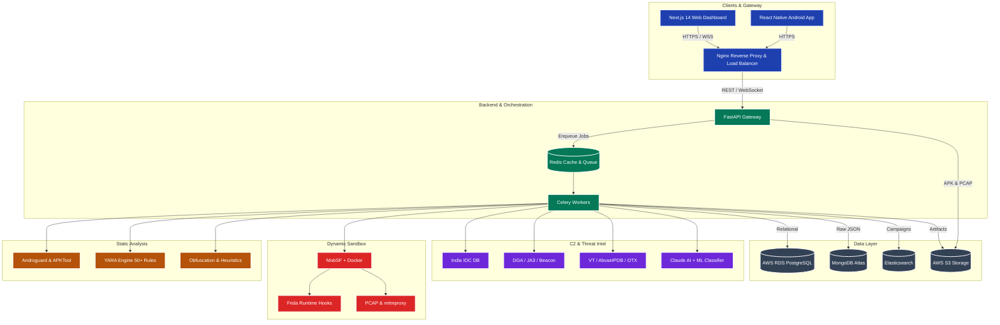

# DroidRaksha 🛡️

**India's AI-Powered APK Threat Intelligence Platform**

DroidRaksha is an advanced, high-performance static analysis platform designed to detect Android malware, specifically tailored for the Indian cybersecurity landscape. It identifies banking trojans, UPI fraud apps, loan scams, and other mobile threats through a multi-engine analysis pipeline, leveraging YARA rules, heuristics, and AI-driven narrative generation.

🎥 **YouTube Demo:** [DroidRaksha – An AI Powered APK Threat Intelligence Platform by PHAPGUYZ](https://www.youtube.com/watch?v=your-video-id)

## 🏗️ Architecture

DroidRaksha (Round 2) employs a scalable, microservices-based architecture designed for distributed threat analysis:



### 🔍 Detailed Architecture Explanation

The architecture is divided into six primary subsystems working together to analyze and classify Android APKs:

#### 1. Clients & Gateway
*   **Next.js 14 Web Dashboard & React Native Android App:** Serve as the user interfaces for analysts and end-users to submit APKs and view results.
*   **Nginx Reverse Proxy & Load Balancer:** The secure entry point that handles incoming HTTPS/WSS traffic, providing SSL termination and routing requests to the backend.

#### 2. Backend & Orchestration
*   **FastAPI Gateway:** The core asynchronous API that processes REST requests and manages real-time WebSocket connections.
*   **Redis Cache & Queue:** Acts as a high-speed message broker for job queuing and caches state for fast lookups.
*   **Celery Workers:** Distributed worker nodes that pull jobs from Redis and asynchronously execute resource-intensive static and dynamic analysis tasks.

#### 3. Static Analysis
*   **Androguard & APKTool:** Tools for reverse engineering, decompiling the APK, and extracting manifest data and bytecode.
*   **YARA Engine (50+ Rules):** Scans the extracted files against a comprehensive ruleset to detect known malicious signatures.
*   **Obfuscation & Heuristics:** Specialized modules that identify packed code, hidden payloads, and suspicious static traits.

#### 4. Dynamic Sandbox
*   **MobSF + Docker:** A secure, containerized environment where the APK is executed safely to monitor its behavior.
*   **Frida Runtime Hooks:** Used to hook into the running application to trace API calls, file I/O, and cryptographic operations.
*   **PCAP & mitmproxy:** Captures and analyzes network traffic to identify suspicious communications.

#### 5. C2 & Threat Intel
*   **India IOC DB:** A curated database of Indicators of Compromise (IOCs) specifically targeting the Indian landscape (e.g., fake UPI apps).
*   **DGA / JA3 / Beaconing Detection:** Advanced network analysis to identify Domain Generation Algorithms, malicious TLS fingerprints (JA3), and C2 beaconing.
*   **External APIs (VT / AbuseIPDB / OTX):** Integrations with VirusTotal, AbuseIPDB, and AlienVault OTX to enrich threat data.
*   **Claude AI + ML Classifier:** AI-driven threat narrative generation and custom machine learning models to classify the malware family.

#### 6. Data Layer
*   **AWS RDS (PostgreSQL):** Stores relational data like user details, scan metadata, and structured metrics.
*   **MongoDB Atlas:** Stores large, unstructured JSON outputs from the analysis engines.
*   **Elasticsearch:** Enables rapid search capabilities across IOCs and assists in clustering related threat campaigns.
*   **AWS S3 Storage:** Secure object storage for heavy artifacts including uploaded APKs, captured PCAPs, and generated PDF reports.

## 📁 Folder Structure

```text
DroidRaksha/
├── backend/
│   ├── ai/
│   │   ├── narrative.py          ← Gemini-powered threat narrative
│   │   ├── classifier.py         ← Rule-based malware family classifier
│   │   ├── mitre_full.py         ← MITRE ATT&CK 40+ technique mapper
│   │   ├── xgboost_classifier.py ← XGBoost + SHAP (MalDroid 2020)
│   │   ├── anomaly_detector.py   ← Isolation Forest zero-day detection
│   │   ├── malbert_classifier.py ← HuggingFace BART zero-shot
│   │   └── langchain_agent.py    ← LangChain ReAct Agent (Gemini Flash)
│   ├── db/
│   │   └── database.py           ← SQLite + AnalysisRecord + PCAPRecord
│   ├── engines/
│   │   ├── cert_analyzer.py
│   │   ├── manifest_parser.py
│   │   ├── obfuscation.py
│   │   ├── pcap_analyzer.py      ← PCAP: DNS, HTTP, TLS-SNI, beaconing, DGA
│   │   ├── static_analyzer.py
│   │   ├── string_extractor.py
│   │   └── yara_scanner.py
│   ├── intel/
│   │   ├── abuseipdb.py
│   │   ├── india_ioc.py
│   │   └── virustotal.py
│   ├── models/
│   │   └── schemas.py
│   ├── routes/
│   │   ├── analysis.py
│   │   ├── report.py
│   │   ├── stats.py
│   │   └── upload.py             ← POST /upload + POST /upload/pcap
│   ├── scoring/
│   │   └── risk_scorer.py
│   └── worker/
│       ├── celery_app.py
│       └── tasks.py              ← 15-stage async analysis pipeline
├── frontend/
│   ├── app/
│   │   ├── dashboard/page.tsx    ← Analytics dashboard (KPIs, charts, threat feed)
│   │   ├── results/[id]/page.tsx ← 5-tab results page
│   │   ├── globals.css
│   │   ├── layout.tsx
│   │   └── page.tsx              ← Landing + APK upload
│   ├── components/
│   │   ├── AIExplanation.tsx
│   │   ├── AnalysisLoader.tsx
│   │   ├── CertificateCard.tsx
│   │   ├── DropZone.tsx
│   │   ├── MalwareFamilyBadge.tsx← ML ensemble badge + SHAP chart
│   │   ├── MitreTable.tsx
│   │   ├── NetworkTrafficPanel.tsx← PCAP analysis panel + upload zone
│   │   ├── PermissionTable.tsx
│   │   ├── RiskScoreCard.tsx
│   │   └── StringsTable.tsx
│   ├── lib/
│   │   ├── api.ts
│   │   ├── types.ts
│   │   └── utils.ts
│   ├── package.json
│   └── tsconfig.json
├── models/
│   ├── xgboost_maldroid.pkl  ← Trained XGBoost model
│   ├── isolation_forest.pkl  ← Trained Isolation Forest
│   └── feature_columns.json  ← Feature name mapping
├── rules/
│   ├── india_patterns.yar
│   └── malware.yar
├── scripts/
│   └── train_xgboost_maldroid.py ← One-time training script (Colab-ready)
├── uploads/                  ← APK + PCAP storage (gitignored)
├── README.md
└── requirements.txt
```

## 🛠️ Tech Stack & Technical Decisions (Round 2)

DroidRaksha is built using a modern, scalable, and distributed technology stack, designed to handle intensive static and dynamic analysis workloads securely.

### 💻 Client & Gateway
- **Frontend:** Next.js 14 (App Router) + TypeScript, featuring a stark Cyber Terminal Aesthetic using custom Vanilla CSS (glass panels, monospace fonts, `.corner-brackets`). Includes interactive HTML5 Canvas 3D particle meshes for the landing page.
- **Mobile App:** React Native application for Android users.
- **Gateway & Real-time:** Nginx reverse proxy with WebSockets for true live analysis progress tracking.

### ⚙️ Backend Orchestration
- **API Framework:** FastAPI (Python) for fully asynchronous endpoint handling.
- **Job Queue:** Celery with Redis as the message broker, offloading heavy static and dynamic analysis to distributed workers.
- **Caching:** Redis for fast state lookups and WebSocket state management.

### 🔍 Core Analysis & Sandbox Engines
- **Static Analysis:** Androguard, APKTool, and an extensive YARA engine (50+ comprehensive rules).
- **Dynamic Analysis:** Dockerized MobSF sandbox environment.
- **Runtime Monitoring:** Frida for API/file I/O hooking and `tcpdump`/`mitmproxy` for full PCAP network analysis.

### 🧠 Threat Intelligence & C2 Detection
- **AI & ML Intelligence Layer:**
  - **XGBoost Classifier:** Trained on CICMalDroid 2020 dataset for 5-class malware detection.
  - **Isolation Forest:** For zero-day anomaly detection.
  - **MalBERT:** Zero-shot text classification using `facebook/bart-large-mnli` on manifest and rules.
  - **LangChain Agent:** Autonomous ReAct agent (powered by Gemini Flash) synthesizing evidence into court-admissible verdicts.
  - **SHAP Explainability:** Interpretable AI output showing exact feature impact.
- **External Intel:** Integration with VirusTotal (Hash/URL/IP), AbuseIPDB, and AlienVault OTX.
- **Advanced C2 Detection:** Algorithms for detecting DGA (Domain Generation Algorithms) via Shannon entropy, TLS JA3 fingerprint matching, and timing variance analysis for live beacon detection.
- **India IOC Engine:** A fully managed database with an admin API for updating known fake UPI apps, fraudulent loan domains, and malicious Indian IPs.

### 🗄️ Distributed Data Layer
- **Relational DB:** AWS RDS (PostgreSQL) for metadata and structured threat metrics.
- **Document DB:** MongoDB Atlas for storing raw, unstructured JSON analysis results.
- **Search Engine:** Elasticsearch for rapid IOC searching and threat campaign clustering.
- **Storage:** AWS S3 for secure, scalable storage of raw APKs, PCAP dumps, and branded forensic PDF reports.

### 🚀 Infrastructure & DevOps
- **Deployment:** Docker Compose migrating to Kubernetes on AWS EC2.
- **CI/CD & Monitoring:** Automated deployment via GitHub Actions with Sentry and Grafana for error tracking and metrics monitoring.
- **Sharing:** Threat intelligence sharing via STIX 2.1 / TAXII exports and a rate-limited Bulk REST API.

## 🗺️ Roadmap & Task Status

### Phase 1: Project Scaffold & Core Backend [Completed]
- [x] Create project directory structure, `requirements.txt`, `.env.example`
- [x] Implement `backend/db/database.py` (SQLite/PostgreSQL)
- [x] Configure basic YARA rules (`malware.yar`, `india_patterns.yar`)
- [x] Implement core static analysis engines (Manifest, Strings, Cert, YARA, Obfuscation)

### Phase 2: Threat Intel & API Routes [Completed]
- [x] Integrate external intel (VirusTotal, AbuseIPDB)
- [x] Create India-specific IOC engine
- [x] Implement risk scorer and Claude/Gemini narrative generator
- [x] Set up FastAPI routes (`/upload`, `/analysis`, `/report`, `/stats`)

### Phase 3: Round 2 Architecture Upgrade [Completed]
- [x] Migrate to asynchronous Celery workers + Redis Queue
- [x] Integrate Dockerized MobSF for dynamic sandbox analysis
- [x] Add PCAP network traffic analysis & Frida hooking
- [x] Add advanced AI Models: XGBoost, MalBERT, Isolation Forest, LangChain ReAct Agent

### Phase 4: Frontend UI Overhaul [Completed]
- [x] Migrate Next.js frontend to stark Cyber Terminal aesthetic
- [x] Implement HTML5 Canvas interactive particle mesh background
- [x] Build Analytics Dashboard with live feed UI
- [x] Build Detailed Results Page with terminal-style tabs
- [x] Create PCAP Upload & Network Analysis panel
