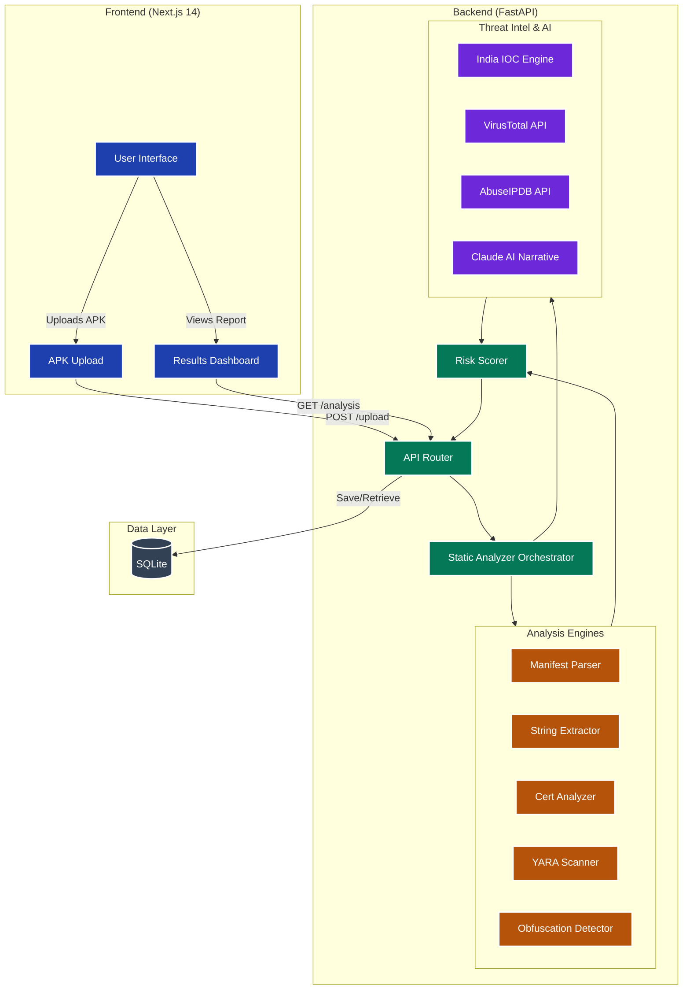

# DroidRaksha 🛡️

**India's AI-Powered APK Threat Intelligence Platform**

DroidRaksha is an advanced, high-performance static analysis platform designed to detect Android malware, specifically tailored for the Indian cybersecurity landscape. It identifies banking trojans, UPI fraud apps, loan scams, and other mobile threats through a multi-engine analysis pipeline, leveraging YARA rules, heuristics, and AI-driven narrative generation.

## 🏗️ Architecture

DroidRaksha employs a two-tier architecture optimized for rapid static analysis and detailed reporting:

1. **Frontend (Next.js 14):** A professional, responsive, dark-themed dashboard that allows users to upload APKs, view real-time analysis progress, and explore detailed threat reports. It visualizes risk scores, permission analysis, extracted strings, certificate validation, and AI-generated threat narratives.
2. **Backend (FastAPI):** A high-performance asynchronous API that orchestrates the analysis pipeline. It processes APK uploads, extracts metadata and bytecode using `androguard`, runs YARA rules, performs heuristic obfuscation detection, queries threat intelligence APIs (VirusTotal, AbuseIPDB), and cross-references India-specific IOCs (Indicators of Compromise). Finally, it aggregates the findings using a custom risk scorer and generates a natural language threat report using Claude AI.
3. **Database (SQLite + SQLAlchemy):** Stores analysis results for caching, historical tracking, and generating dashboard statistics.

## 🛠️ Tech Stack & Technical Decisions

DroidRaksha is built using a modern, scalable, and type-safe technology stack. Every tool was chosen to ensure high performance, maintainability, and rapid analysis capabilities.

### 💻 Frontend (Client & UI)
- **Next.js 14 (App Router):** Chosen for its hybrid rendering capabilities (Server-Side Rendering for the public reports and fast Client-Side interactions for the dashboard).
- **TypeScript:** Ensures end-to-end type safety, reducing runtime errors and improving developer experience when handling complex threat JSON structures.
- **Tailwind CSS & shadcn/ui:** Provides a robust, highly customizable design system to create a professional, dark-themed, and responsive dashboard without the overhead of heavy component libraries.
- **Lucide React:** A clean, lightweight icon library to enhance the visual hierarchy of threat indicators and risk levels.

### ⚙️ Backend (API & Orchestration)
- **FastAPI (Python 3.11+):** The core API framework. Selected for its exceptional asynchronous performance (vital for concurrent API lookups and non-blocking I/O) and native Pydantic validation.
- **Pydantic V2:** Used for strict data validation and serialization of the complex JSON analysis reports.
- **Loguru:** Replaces standard logging with structured, easily readable, and highly configurable logs to track the analysis pipeline effectively.

### 🔍 Core Analysis & Detection Engines
- **Androguard:** The foundational engine for Android reverse engineering. It parses the APK, extracts the `AndroidManifest.xml`, and decompiles DEX bytecode to facilitate static analysis.
- **YARA (yara-python):** The industry standard for pattern matching. We use it to run custom `.yar` rules against both the raw APK and decompiled contents to detect specific malware families and Indian threat actors.
- **Cryptography:** Used to extract, parse, and validate X.509 signing certificates to identify self-signed or expired certificates common in malware.

### 🧠 Threat Intelligence & AI
- **Anthropic Claude API (Opus/Sonnet):** Powers our narrative generation engine. It ingests the raw JSON analysis and outputs a human-readable, professional threat summary mapped to the MITRE ATT&CK framework.
- **VirusTotal API:** Provides community-driven reputation scoring by checking the APK's SHA-256 hash against dozens of antivirus engines.
- **AbuseIPDB API:** Used to cross-reference extracted IP addresses to detect known Command & Control (C2) servers.
- **Custom India IOC Engine:** A proprietary, locally maintained database of known fake UPI apps, fraudulent loan applications, and malicious Indian domains.

### 🗄️ Database & Storage Layer
- **SQLite (via aiosqlite):** Acts as the primary database for the prototype, enabling zero-configuration deployments.
- **SQLAlchemy 2.0 (Async):** The ORM used to interact with the database asynchronously, providing a clear migration path to PostgreSQL for production deployments.

## 🗺️ Roadmap & Task Status

### Phase 1: Project Scaffold
- [x] Create project directory structure
- [x] `requirements.txt`
- [x] `.env.example`
- [x] `README.md`

### Phase 2: Backend — Core
- [x] `backend/models/schemas.py` (Pydantic models)
- [x] `backend/db/database.py` (SQLite + SQLAlchemy)
- [x] YARA rules: `rules/malware.yar`
- [x] YARA rules: `rules/india_patterns.yar`

### Phase 3: Backend — Analysis Engines
- [x] `backend/engines/manifest_parser.py`
- [x] `backend/engines/string_extractor.py`
- [x] `backend/engines/cert_analyzer.py`
- [x] `backend/engines/yara_scanner.py`
- [x] `backend/engines/obfuscation.py`

### Phase 4: Backend — Intel + AI
- [x] `backend/intel/india_ioc.py`
- [x] `backend/intel/virustotal.py`
- [x] `backend/intel/abuseipdb.py`
- [x] `backend/scoring/risk_scorer.py`
- [x] `backend/ai/narrative.py`
- [x] `backend/engines/static_analyzer.py` (orchestrator)

### Phase 5: Backend — API Routes
- [x] `backend/routes/upload.py`
- [x] `backend/routes/analysis.py`
- [x] `backend/routes/report.py`
- [x] `backend/routes/stats.py`
- [x] `backend/main.py`
- [x] `backend/__init__.py` (and all sub-package init files)

### Phase 6: Frontend — Foundation
- [x] Next.js 14 project init
- [x] Install tailwind and basic configuration
- [x] Install shadcn/ui defaults
- [x] Add basic shadcn components (badge, card, progress, table, tabs)
- [ ] `frontend/app/layout.tsx`
- [ ] `frontend/lib/types.ts`
- [ ] `frontend/lib/api.ts`

### Phase 7: Frontend — Components
- [ ] `frontend/components/DropZone.tsx`
- [ ] `frontend/components/AnalysisLoader.tsx`
- [ ] `frontend/components/RiskScoreCard.tsx`
- [ ] `frontend/components/AIExplanation.tsx`
- [ ] `frontend/components/PermissionTable.tsx`
- [ ] `frontend/components/StringsTable.tsx`
- [ ] `frontend/components/CertificateCard.tsx`
- [ ] `frontend/components/MitreTable.tsx`
- [ ] `frontend/components/ExportButton.tsx`

### Phase 8: Frontend — Pages
- [ ] `frontend/app/page.tsx` (landing + upload)
- [ ] `frontend/app/results/[id]/page.tsx`
- [ ] `frontend/app/report/[hash]/page.tsx` (SSR)

### Phase 9: Verification & Launch
- [ ] Backend startup test
- [ ] Frontend startup test
- [ ] End-to-end upload test
- [ ] Final UI Polish
